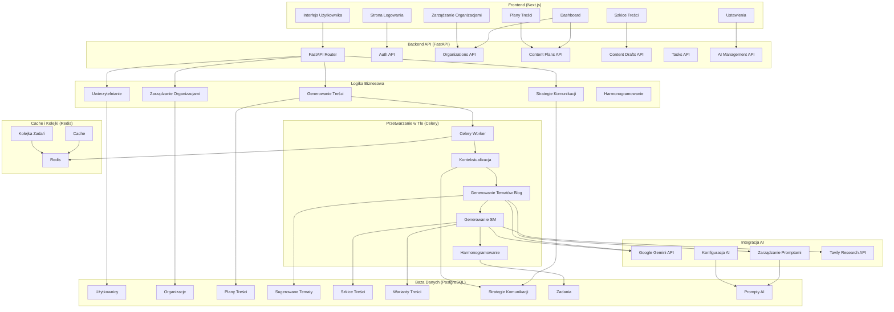
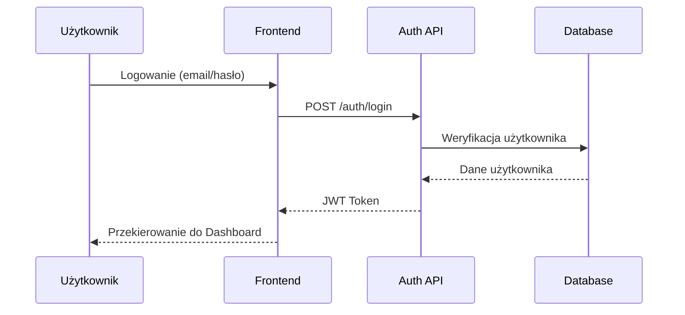
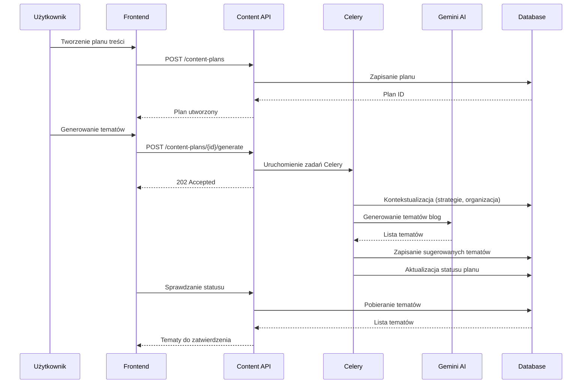
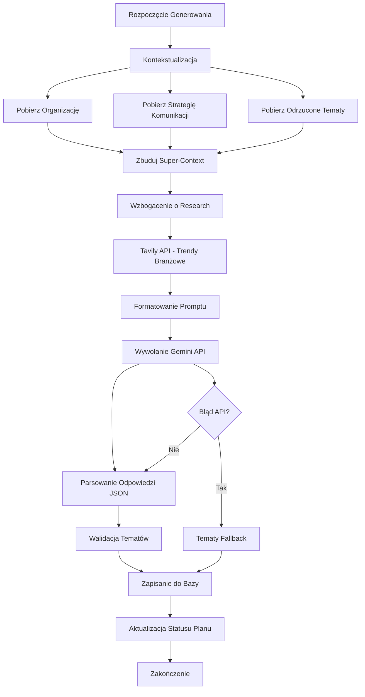
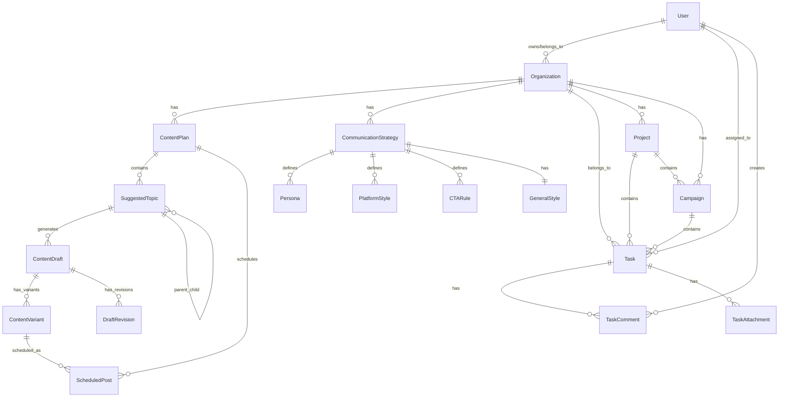
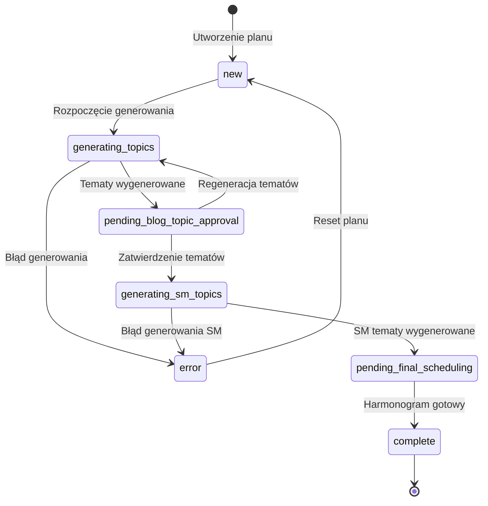
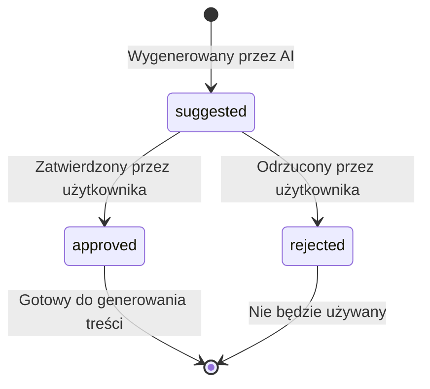
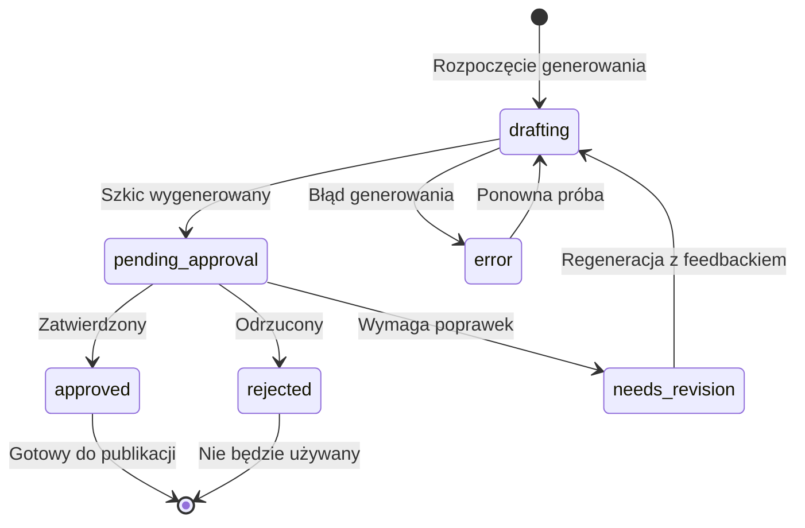
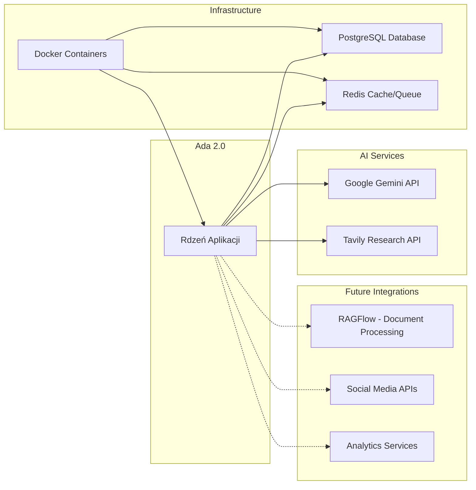

# Ada 2.0 - Graf Logiki Działania Aplikacji

## Architektura Systemu

## Przepływ Głównych Procesów

### 1. Proces Uwierzytelniania

### 2. Proces Tworzenia Planu Treści

### 3. Proces Generowania Treści AI

## Modele Danych - Relacje

## Stany i Przepływy Statusów

### Status Planu Treści

### Status Sugerowanych Tematów

### Status Szkiców Treści

## Integracje Zewnętrzne

## Kluczowe Funkcjonalności

### 1. **Multi-organizacyjność**
- Użytkownicy mogą należeć do wielu organizacji
- Każda organizacja ma własne strategie komunikacji
- Izolacja danych między organizacjami

### 2. **Generowanie Treści AI**
- Kontekstualizacja na podstawie strategii komunikacji
- Generowanie tematów blog i social media
- Korelacja między treściami blog a SM

### 3. **Zarządzanie Przepływem Pracy**
- Statusy planów treści i tematów
- Zatwierdzanie i odrzucanie tematów
- Regeneracja z uwzględnieniem feedbacku

### 4. **Przetwarzanie Asynchroniczne**
- Celery do długotrwałych zadań AI
- Redis jako broker kolejek
- Łańcuchy zadań dla złożonych procesów

### 5. **Elastyczna Architektura**
- Mikrousługi z FastAPI
- Separacja frontend/backend
- Konteneryzacja z Docker

Ten graf przedstawia kompletną logikę działania aplikacji Ada 2.0, od interfejsu użytkownika przez API, logikę biznesową, przetwarzanie AI, aż po bazę danych i integracje zewnętrzne.